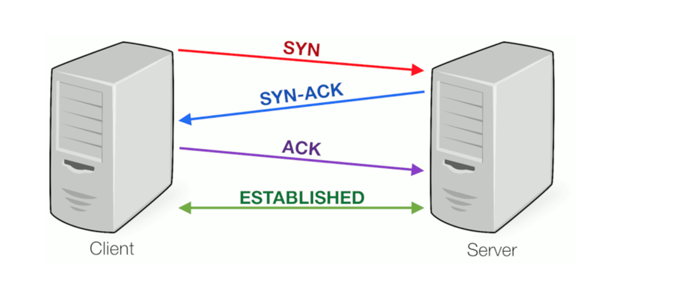

In this section of the Security Fundamentals domain will provide an introduction to networking covering the OSI model, port and services, and how networks are created to allow systems to communicate. Whilist this section will cover enough to get you through the course, we strongly suggest that you develop your networking skills outside of this course as this knowledge will be required in almost any security role.

## Network Fundamentals
Whilst teaching networking in detail is not in the scope of BTL1, we will cover some basics to assist our students that don't have much experience with this topic of computing. This lesson will cover what TCP, UDP, and ICMP are, and cover what IP and Mac addresses are to help build a fundamental knowledge of networking.
### TCP

Transmission Control Protocol (TCP) is a connection-oriented protocol that enables two-way data transmission between systems. It ensures reliable communication by detecting and correcting data loss. Operating at the transport layer of the OSI model, TCP is commonly paired with the Internet Protocol (IP) in the TCP/IP protocol stack, forming the backbone of most public and local networks.

TCP communication begins with a **three-way handshake** to establish a connection:

1. The requesting client sends the server an SYN (synchronize) packet with a random number, which ensures
that data is sent in the right order and nothing is missed.
2. The server receives the packet and accepts the connection by sending an SYN-ACK (synchronize acknowledgment) packet back to the client, including the client's sequence number plus 1. It also transmits its own sequence number to the requesting client.
3. Finally, the client acknowledges the receipt of the SYN-ACK segment by sending its own ACK packet, which in this case contains the server's sequence number plus 1. At the same time, the client can already begin transferring data to the server.

You can see how this works in the diagram below:

### UDP

User Datagram Protocol (UDP) is a connectionless protocol that allows datagrams to be sent without establishing a connection in IP-based networks. It operates at the transport layer, acting as an intermediary between the network and application layers.

Key characteristics of UDP:

1. **Connectionless Communication**: UDP transmits data without requiring a connection between sender and receiver. Packets are sent to a specified IP and port without requiring a response. Optionally, the UDP header can include the source port for return packets.
2. **Port Usage**: Similar to TCP, UDP uses ports to direct packets to the correct application, with ports 0–1023 reserved for fixed services.
3. **Fast, Delay-Free Transmission**: UDP allows rapid data transfer since it does not establish a connection. Lost packets affect transmission quality but do not halt the process, unlike TCP, which re-requests lost packets.
4. **No Security or Integrity Guarantees**: UDP does not authenticate senders and receivers, nor does it ensure packet completeness, security, or order. Applications using UDP must implement their own reliability measures.

For further details, refer to RFC 768.

### ICMP

### IP Addresses

An Internet Protocol (IP) address uniquely identifies a device on a network, similar to a physical address. When sending data over the internet, DNS servers translate hostnames (e.g., www.lifewire.com) into IP addresses, enabling computers to locate and communicate with each other.

#### Types of IP Addresses:
**Private IP Addresses**– Used within local networks (e.g., home or office). Devices like tablets, printers, and PCs use these to communicate with the router and other devices. Private IP ranges include:

- 192.168.0.0 – 192.168.255.255

- 172.16.0.0 – 172.31.255.255

- 10.0.0.0 – 10.255.255.255

**Public IP Addresses** – Assigned by an ISP for external network communication. It allows home or business networks to access the internet and interact with global devices.

#### Static vs. Dynamic IPs:
**Dynamic IPs** – Assigned by a DHCP server, changing over time.

**Static IPs** – Manually set and remain constant if DHCP is not enabled.

### MAC Addresses
A Media Access Control (MAC) address is a unique hardware identifier assigned to each network device, such as Ethernet and Wi-Fi cards. It is embedded during manufacturing and cannot be changed (though it can be spoofed by attackers). MAC addresses consist of six pairs of hexadecimal numbers, separated by colons (e.g., 00:0d:83:b1:c0:8e).

To view a MAC address in Windows, search for "Network Status", then click "View your network properties" to see the MAC addresses of wired and wireless network adapters.

****
## The OSI Model
Network communication can be understood through real-life analogies. Imagine sending a gift to a friend in another city. Since you cannot deliver it yourself, you rely on an intermediary who follows specific steps:

1. Provide your address so the intermediary knows where to pick up the package.

2. Wrap the gift securely to protect it during transit.

2. Label the package with the recipient’s name and address.

Once these steps are completed, the intermediary picks up the package, verifies the details, and delivers it to the recipient's home.

Similarly, in the IT world, sending and receiving messages, files, and videos follows a structured process. To better control and manage digital communication, the **OSI (Open Systems Interconnection)** model was developed.

### What is the OSI Model?
The Open Systems Interconnection (OSI) model was developed by ISO in 1984 as a reference framework for understanding network communication. It abstracts how data transmission occurs, detailing the phases and protocols involved.

The OSI model consists of 7 layers, each with a specific role. Each layer serves the one above and is served by the one below, ensuring smooth communication between computers, applications, and networks.

Mnemonic for OSI Layers:
- **Top to Bottom**: All People Seem To Need Data Processing (APSTNDP)

- **Bottom to Top**: Please Do Not Throw Sausage Pizza Away (PDNTSPA)

### OSI Model Layers:

**Step 1: Application Layer (Layer 7)**
- User-facing layer that allows interaction with software.
- Handles email (SMTP), web browsing (HTTP), file transfers (FTP), etc.

**Step 2: Presentation Layer (Layer 6)**
- Acts as a translator between machine and user.
- Formats, encrypts, and decrypts data for readability and security.

**Step 3: Session Layer (Layer 5)**
- Manages communication sessions between devices.
- Handles opening, closing, and resuming connections.

**Step 4: Transport Layer (Layer 4)**
- Ensures reliable or fast data transfer (TCP for reliability, UDP for speed).
- Segments and reassembles packets, manages error correction.

**Step 5: Network Layer (Layer 3)**
- Finds the best route for data to travel between networks.
- Uses IP addresses and routers for data forwarding.

**Step 6: Data Link Layer (Layer 2)**
- Handles framing, MAC addresses, and physical transmission.
- Ensures error detection in network communication.

**Step 7: Physical Layer (Layer 1)**
- Deals with hardware (cables, fiber optics, Wi-Fi signals).
- Defines how bits are transmitted over physical media.

This step-by-step breakdown follows a top-down approach, explaining how data moves from applications to physical transmission.

****
## Netwok devices

****
## Network tools

The purpose of this lesson is to introduce you to some of the tools that are commonly used in networking. These tools are used to troubleshoot network issues, monitor network traffic, and analyze network performance. Some of the tools that we will cover in this lesson include:

### Command Line Tools
**ip&ipconfig**

**Trace Route & Tracert**

**Dig&Nslookup**

**Netstat**

### Network Scanners

****

## Ports and Services
