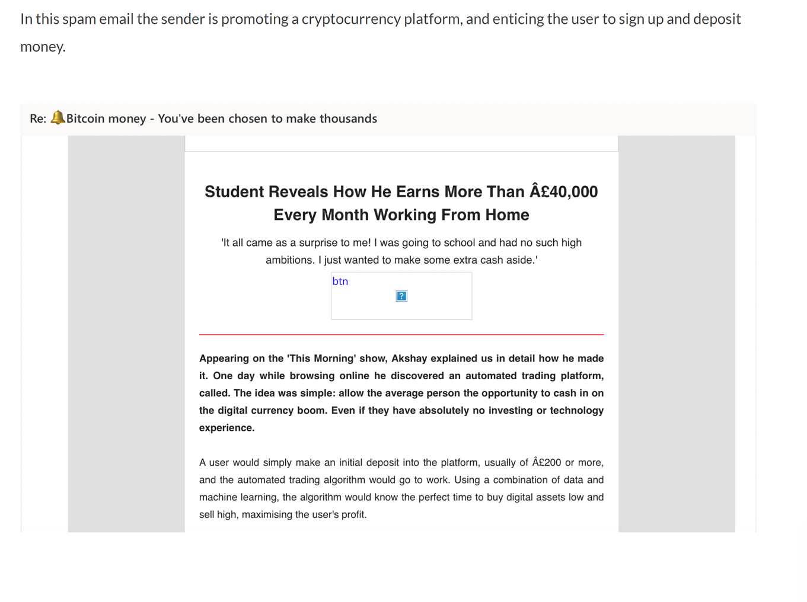

This section covers different types of phishing emails and how attackers use various methods to trick users into downloading malicious files or entering credentials on fake websites. Some techniques are more effective than others. Additionally, it explores social engineering tactics and false positives in phishing detection.

## 🎯 Learning Objectives
By the end of this section, you will be able to:

- Recognize different phishing attack types targeting individuals and organizations.

- Understand non-email-based phishing attacks, such as vishing (voice phishing) and smishing (SMS phishing).

- Identify and classify suspicious emails based on their design, context, and intent.

****

## 🕵️ Reconnaissance 

Reconnaissance emails (or recon emails) are designed to confirm whether a recipient’s email address is active. Attackers use them to prepare for future phishing attacks. A response isn’t always required—malicious actors can determine if an email was delivered or opened through various techniques.

### Types of Recon Emails:
- Spam with random text – Emails containing only meaningless text, such as "adjdfkaweasda."

- Social engineering emails – Messages designed to trick recipients into responding.

- Emails with tracking pixels – These use invisible trackers to detect when an email is opened.

By the end of this lesson, you’ll learn to recognize recon emails and identify any advanced tactics used.

### Tactics Used in Recon Emails:

1. **Spam Recon Emails**

Some reconnaissance emails contain no content or tactics; they are simply sent to check if the recipient's email address is valid. If an email bounces back with an error message like "undeliverable", attackers know the mailbox is inactive. If no error is received, they confirm the mailbox is active and may target it in future phishing attacks.

An example of this is when an email is sent to a nonexistent Gmail address, triggering an "undeliverable" response in Outlook or other email clients.


2. **Social Engineering Recon Emails**

Some reconnaissance emails use social engineering tactics to manipulate recipients into responding. These may involve:

- **Impersonation**: Attackers pose as someone familiar to the recipient, such as a colleague or superior.

- **Urgency**: Messages like “I’m about to meet with stakeholders—have you read the meeting notes?” create panic, leading to hasty actions.

- **Authority Exploitation**: Attackers pretend to be high-ranking officials (e.g., managers, directors) to pressure the target into compliance.

These tactics increase the likelihood of engagement, making impersonation emails a key method in **Business Email Compromise (BEC)** attacks, which will be covered in later lessons.

### Tracking Pixels recon emails

Tracking pixel recon emails combine elements of spam or social engineering emails with an invisible tracking pixel. This pixel allows attackers to determine if an email has been viewed and assess the mailbox's activity level. By monitoring the time between sending and opening, attackers can avoid inactive mailboxes to reduce detection risks.

A tracking pixel is embedded using HTML code in the email body, linking to an external pixel server. When the email is opened, the code loads, notifying the server.

**Data Collected via Tracking Pixels:**

- Operating System: Identifies if the target is using mobile or desktop.
- Email Client Type: Detects if the email is opened in a browser (webmail) or email client (Outlook, Thunderbird, etc.).
- Screen Resolution: Helps tailor phishing content for different devices.
- Date & Time Opened: Tracks user activity patterns.
- IP Address: Reveals ISP details and approximate location.

**Example of Tracking Pixel HTML Code**
```html

```
This code loads a tiny image hosted on an external server, allowing attackers to log email interactions.

**Defense Against Tracking Pixel Attacks**
- Disable automatic image loading in email clients.
- Use email security gateways that strip tracking pixels.
- Monitor network requests for suspicious external image loads.

### Recon email example 1
In this example, an email from Jason9112@gmail.com appears under the name John Smith and contains a random subject line ("asdkf") with meaningless body content. This is a spam recon email, designed to check if the recipient's mailbox is active.

The attacker is not expecting a human response since the email lacks a request or action. Instead, they are monitoring whether an "undeliverable" message is generated. If no such message is received, the attacker confirms the mailbox is valid and may target it in future phishing attempts.


### Recon email example 2
In this case, bobtom112233@gmail.com sends an email to contact@dicksonunited.co.uk with the subject "Hello" and a vague message starting with "hi there". The email lacks personalization and does not seem directed at a specific individual.

A key red flag is that the sender claims to be "your friend Dan", yet the email is sent to a group mailbox ("contact@domain"), which is unusual for personal communication. This suggests the email is a recon email, designed to check if the recipient's mailbox is active for future phishing attempts.


### Conclusion
Recon emails are frequently encountered by large organizations and often bypass email security gateways since they lack obvious malicious indicators. Basic recon emails contain only body text, while more advanced versions may use social engineering or tracking pixels to gather additional intelligence.

Once attackers confirm that an email address is active, it can either be sold to other malicious actors for phishing campaigns or used directly by the original sender for future targeted attacks.


****
## 📧 Spam Emails

Spam emails (also known as "junk mail") are messages that are unsolicited, unwanted, or unexpected but are not necessarily malicious in nature. Examples of spam emails are:

- Newsletters that the user has unknowingly signed up for
- Marketing emails trying to promote products and services
- Update announcements from companies and services the user has registered with

Spam emails should not be confused with malicious spam emails (malspam for short). Malicious spam emails are malicious messages that are sent on a mass scale (as opposed to being targeted at an individual or organization).


Above is a screenshot from a honeypot mailbox we use to collect spam and malicious emails. You can see the scale of the unsolicited spam emails we have received, with the majority being bitcoin-based, trying to get recipients to sign up to different cryptocurrency exchanges or buy into schemes to make them millions! Without further investigation, these emails would be classified as spam, but some could potentially be malspam.

Our junk inbox included emails covering the following topics:

- Bitcoin/cryptocurrency
- Personal Protective Equipment (PPE - expected to see emails of this nature due to COVID-19 pandemic at time of writing)
- Sexual performance-enhancing products
- Non-cryptocurrency financial schemes
- Adult dating
- Marketing emails from restaurants
- Diet/weight-altering products

It's worth mentioning that we haven't signed up to receive these emails. It appears that this email address has been shared or sold between organizations, and we have been added to email marketing lists without our expressed permission.

### Examples of Spam Emails 1
A WordPress plugin vendor sends marketing emails to registered users who likely consented by agreeing to the Terms of Service and Privacy Policy during registration. Although these emails are not malicious, they are often unwanted and contribute to mailbox clutter. Such emails should include an "unsubscribe" link at the bottom, allowing recipients to remove themselves from the mailing list.


### Examples of Spam Emails 2



### Conclusion
While spam emails are usually not malicious, users should be cautious, avoiding attachments and hyperlinks. Organizations may instruct users to delete such emails or report them to security teams. Spam should not be confused with malicious spam (malspam), which spreads malware like Emotet. Spam can also serve reconnaissance purposes, where clicking an unsubscribe link may enable system fingerprinting and confirm mailbox activity.


****
## 🚫 False Positives 

Emails that are classed as false positives are messages that have not been sent by a malicious actor, and are instead legitimate emails that have been incorrectly reported as malicious. There are a number of reasons that false positives can occur:

- The user believes the email is malicious or potentially malicious
- The email has poor formatting (usually internal emails) and appears to be suspicious
- The email is unexpected and asks the user to complete an action (click this button, contact us immediately, transfer funds to this account, etc) 
- The user is not familiar with identifying malicious emails due to a lack of phishing awareness training

Having employees report emails that turn out to be false positives is not necessarily a bad thing. It shows that users are engaged with reporting emails they believe to be suspicious, which is arguably better than them not reporting anything at all. It takes one email to compromise a system and a network, so we're sure most organizations would rather deal with a few false positives than miss genuine malicious emails.

****
## 🚫 Credential Harvesting Emails
Credential harvesters are one of the most common phishing email types, exploiting human vulnerabilities to steal valid credentials. These attacks often use emails that mimic legitimate companies like Outlook, Amazon, or DHL, urging recipients to click a link that leads to a fake login page. Any credentials entered are either stored or sent to an attacker-controlled email account.

Recognizing credential harvesters is crucial, as they can lead to serious consequences, including compromised work and personal accounts, fraud, social engineering, business email compromise, and blackmail. Attackers may even create fake login portals tailored to a specific organization by extracting branding elements from company websites or search results, increasing their effectiveness.

next social engineering
****
## 🎭 Social Engineering
Social engineering exploits human psychology rather than technical vulnerabilities, manipulating individuals into actions they wouldn’t normally take, such as revealing confidential information, granting unauthorized access, or transferring money. Phishing is a form of social engineering.

Common phishing tactics include:

- Encouraging recipients to respond to reconnaissance emails.
- Impersonating executives to request financial transfers.
- Pretending to be trusted individuals to extract confidential data.

Phishing attacks rely on human behavior, not system weaknesses. Attackers create urgency, authority, or familiarity to manipulate targets into compliance. Since phishing primarily exploits human trust, recognizing these tactics is essential for defense.
https://www.youtube.com/watch?v=yhE372sqURU


****
## 📞 Vishing and Smishing

This lesson covers two phone-based phishing attacks: vishing and smishing, which use voice calls and text messages instead of email to deceive victims. These attacks are harder to monitor since security teams typically lack access to employee text messages.

### Smishing (SMS Phishing)
Smishing is a kind of phishing attack, where the attack vector is through a text message or SMS. Below would be a profile that a smishing attack could follow:

**Victim**: This type of phishing can often be sent in bulk to multiple cell phones/message services at one time,
resulting in a generic victim profile.

**Target**: Most often these attacks are after Personal Identifiable Information (PII) or banking or financial information
such as credit card details, known as Payment Card Information (PCI), therefore there is no specific target group.

**Ways to Defend**: The best way to defend is user security awareness training and education, as well as being diligent in clicking links or completing actions sent from unknown phone numbers or impossible phone numbers (such as 4291). Many services provide "do not text/anti-bot" lists which can help mitigate some of these threats as well.

Below is an example of a fake PayPal-themed attack via text message, which may seem legitimate at a glance, but the URL is actually: **PayPal. verification-procedure[. ]com** (the domain is "verification-procedure[.]com", instead of "PayPal.com")


### Vishing (Voice Phishing)

Similar to smishing, vishing is a kind of phishing attack, where the attack vector is through a phone call. This method relies heavily on the social engineering aspect of phishing by having direct voice-to-voice contact with their victim.

Below would be a profile that a vishing attack could follow:

**Victim**: The victim of vishing attack often are people in the organization that would have access to sensitive information, often being one or two levels below the "C" level executive

**Target**: Most often these attacks go after financial information or corporate accounts that could give them access to the network.

**Ways to Defend**: As with smishing one of the best ways to defend is user security awareness training and education, especially when it comes to sharing passwords with someone without verification, but blocking auto callers helps decrease vishing attempts as well. Having internal authorization codes would also trip up an external malicious actor, as they wouldn't know the private codes. Separation of duties can also work to reduce the number of people that have the appropriate access to complete actions such as processing payments.

### Social Engineering CTF


****
## 🐋 Whaling
Whaling is a highly-targeted phishing attack that looks to target individuals within management positions in an organization, often C-level executives, due to the wealth of information they have access to, and that stereotypically they are not highly educated around cybersecurity and phishing. Targets often include: 

- **Chief Operations Officer (COO)**
- **Chief Executive Officer (CEO)** 
- **Chief Finance Officer (CFO)** 
  
These emails will be refined typically using information gained from open-source intelligence sources, making them more believable for the intended target, increasing the chance they will interact with it. Attacks could attempt to entice the target to download a file that will download malware to the system, try to extract their credentials by sending them a link to a credential harvester, or simply work to extract private or confidential information from the individual using social engineering tactics. 

Whaling is one of the most difficult types of phishing to detect because they are sent in very small volumes and are tailored to appear legitimate and not generate red flags that could alert the security tools or team. Education and adoption of senior management, marking external emails by appending the subject line or email body text, and implementing policies such as data loss prevention are some of the best methods to mitigate these threats. Often business executives will have a personal assistant who monitors their mailbox for them - these individuals should be trained specially to detect phishing emails, and report them to the security team, ensuring they are not opened by the business executive.

****
## 📎 Malicious Attachments
Along with credential harvesters, emails that convince targets to open malicious files are the most common phishing email classifications. This lesson will cover how malicious actors can get recipients to open malicious files, and what these can include. There are two main methods of delivering malware via phishing, as an attachment, or as a hyperlink taking the target to a web server that is hosting malware available for download.

### Malicious Attachments
Sending malware via email isn’t as simple as attaching an .exe file, as most email providers block certain file types and scan for malware. Instead, attackers use more deceptive methods.

- **Obvious Threats**: Files with extensions like .vbs (Visual Basic Script) are uncommon for most users, making them more suspicious.

- **Deceptive Threats**: Microsoft Office files (Word, Excel, etc.) are widely used in organizations, making them seem less suspicious. While these files aren’t inherently malware, they can contain malicious macros that, when enabled, execute harmful scripts.

Attackers exploit the trust users have in familiar file formats to bypass security measures and trick victims into executing malicious code.

#### MS Office Macro Malware
MS Office documents like Word and Excel support macros, which are automated commands that run when enabled. In the past, macro malware was widespread because macros executed automatically upon opening a document. However, recent Microsoft Office versions disable macros by default. As a result, malware authors now use fake warnings to trick users into enabling macros, allowing their malware to execute.


The screenshot depicts a malicious Microsoft Word document. While the legitimate ribbon at the top includes an "Enable Content" button to unlock the document and allow macros to run, everything below is fake and crafted by the attacker. The attacker attempts to deceive the recipient with a fabricated error message, urging them to convert the document to a newer version. If macros are enabled, they can connect to external domains and download various types of malware, including viruses, trojans, ransomware, and rootkits.


To defend against macro malware, it is essential to implement proper security measures and train users to recognize suspicious emails. Microsoft provides key recommendations:

- Ensure macros are disabled in Microsoft Office applications, with IT admins managing default settings.
- Avoid opening suspicious emails or attachments.
- Delete emails from unknown senders or those containing suspicious content, as spam emails are a primary vector for macro malware.
- Enterprises can enhance security by using Attack Surface Reduction (ASR) rules to prevent macro malware from executing harmful content.

### Hosted Malware

The other primarily delivery method of malware is by hosting it on websites, and convincing users to click on a hyperlink, download a file, and then run it. It's very similar to macro malware, but users need to manually visit and download the malware themselves.

#### Malicious Domain
Domains can be easily and quickly registered at a low cost, making them a common tool for malicious activity. According to SC Magazine in August 2019, around 200,000 new domains are registered daily, with 70% being malicious or suspicious. This amounts to 140,000 harmful domains each day. Attackers can simply host a malicious file on a URL and distribute it through phishing emails to target victims.


#### Compromised Domains
Legitimate sites can be compromised by attackers, and then used to host malware. Often the legitimate site is left completely intact so that the site owner and visitors don't realise their site has been hacked and is being utilised for malicious purposes. A hyperlink to the malicious URL hosting the malware is then distributed in phishing emails.


