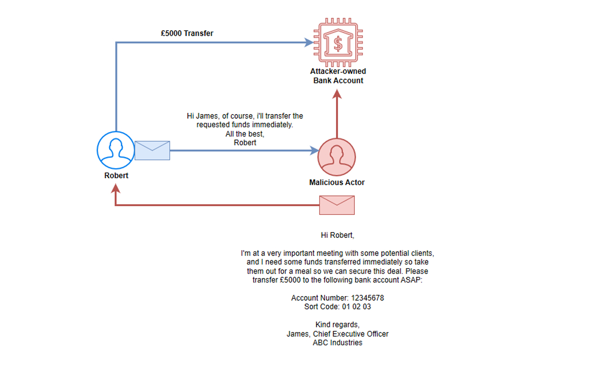
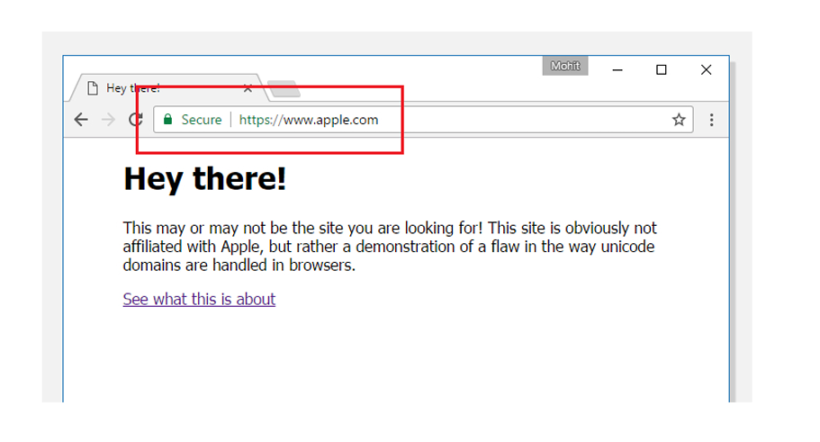

This section of the Phishing Analysis domain will introduce you to the tactics and techniques used by malicious
actors to try and make their emails as effective as possible. There are a lot of techniques that can be used to make
emails seem legitimate, increase the chances of targets interacting with malicious elements, bypassing security
features such as emails scanning, or make it harder for security teams to take defensive measures and stop

malicious emails being delivered to employee mailboxes.

## LEARNING OBJECTIVES 🎯

By the end of this section you will have achieved the following objectives:

. Understand the techniques utilized by malicious actors to make emails more convincing to recipients such as:
hyperlinks, attachments, impersonation, typosquatting, and email styling.
. Identify the techniques that have been used in real phishing emails.

next spear phishing 
## Spear Phishing 🎣

Spear phishing involves a malicious actor gathering information about a specific target before launching a phishing attack. By tailoring emails to the target’s interests, habits, and relationships, the attacker increases the likelihood of the recipient clicking a link, entering credentials, or opening a malicious attachment. This method relies on OSINT sources, such as social media, to collect details about the target’s online activities and connections, making the emails appear legitimate.

Other techniques, such as typosquatting and sender spoofing, can be used to make phishing emails more convincing by mimicking real websites or trusted senders.

**Example Walkthrough:**
An attacker targets an employee at Dickson United to trick them into opening a malicious attachment that grants remote access to their corporate device. By finding the employee on LinkedIn and performing a reverse-image search, the attacker discovers their Facebook account and gathers personal information due to weak privacy settings. Using these details, they craft a highly personalized spear-phishing email, incorporating social engineering tactics like impersonation. This method is widely used by advanced threat actors and has led to many data breaches.

## Impersonation 🎭
Impersonation involves a malicious actor pretending to be someone else to deceive their target. By posing as a friend, colleague, or high-ranking official within an organization, attackers increase the chances of their phishing email being trusted and acted upon.

If an attacker impersonates someone with authority, such as a manager or CEO, the target may comply with requests without questioning them, fearing negative consequences for non-compliance.

An example of this tactic is a phishing attack where a malicious actor pretends to be the CEO and convinces an employee in the Finance Department to transfer funds to an attacker-controlled bank account.

## Typosquatting and Homograph Attacks 📝
### Typosquatting
Typosquatting is a technique where attackers register misspelled versions of legitimate domain names to impersonate a brand or website. This can involve missing or extra letters, or subtle character substitutions, making the fake domain appear legitimate at first glance.

For example, attackers may register variations of **securityblue.team**:

- securltyblue.team (using a lowercase "L" instead of "i")

- securitybllue.team (adding an extra "L")

- securtyblue.team (missing an "i")

To counter this threat, large organizations may generate lists of similar-looking domains and either monitor their registration or preemptively buy them to prevent misuse.

As a demonstration, the example domain securltyblue.team was purchased to showcase this tactic in action.

### Typosquatting Example Walkthrough
This tactic involves registering a misspelled domain to create deceptive websites and email addresses. Attackers use this to send phishing emails that appear legitimate, tricking targets into revealing sensitive information.

In this scenario, hackers aim to gather personal details about John Doe, an IT service desk analyst at Dickson United, to blackmail him into providing remote access to company servers. They target Samantha Moore, a new HR employee, using a typosquatting domain.

The real domain: DicksonUnited.co.uk
The fake domain: DicksonUnted.co.uk (with a swapped "i" and "t")

Attack Execution:
1. The attackers identify Samantha’s work email using the company’s standard format: samantha.moore@DicksonUnited.co.uk.
2. They register the fake domain DicksonUnted.co.uk, which allows them to create custom emails.
3. Using this, they set up a fake senior HR manager email: Chloe.wood@dicksonunted.co.uk.
4. They send a phishing email to Samantha, pretending to be Chloe Wood, a high-ranking HR manager.
5. The email appears legitimate at first glance, leading Samantha to unknowingly provide John Doe’s personal details to the attackers.

This example highlights how typosquatting can be used in spear phishing attacks to exploit trust and deceive employees into leaking sensitive information.

### Homograph Attacks
A homograph phishing attack is extremely difficult for users to detect because it exploits characters that look identical but have different Unicode encodings.

Wikipedia explains that Unicode includes multiple writing systems, and similar-looking characters—such as the Greek O, Latin O, and Cyrillic O—each have unique codes. This means that a domain using a Latin "o" and another using a Cyrillic "o" are technically different, even though they appear identical.

Attackers use internationalized domain names (IDN), which support non-Latin characters, to create deceptive URLs for phishing attacks. These homograph domains trick users into believing they are accessing a legitimate website when, in reality, they are interacting with a malicious one.

The alarming aspect of homograph attacks is that users cannot visually detect them, rendering security awareness training ineffective in preventing interactions with phishing emails that exploit homograph domain names.

To mitigate this risk, organizations must rely on email security technology, such as tools that automatically visit hyperlinks within emails to determine if they are malicious.

A notable example of a homograph attack is discussed in BitDefender’s article, "New Homograph Phishing Attack Impersonates Bank of Valletta". Another valuable resource is The Hacker News, which provides insights into homograph attack techniques and their impact.

1. https://labs.bitdefender.com/2019/08/new-homograph-phishing-attack-impersonates-bank-of-valletta-leverages-valid-tls-certificate/
2. https://thehackernews.com/2017/04/unicode-Punycode-phishing-attack.html

## Sender Spoofing 📧
Sender spoofing is the act of disguising the sender's email address to appear as a legitimate source, deceiving recipients into believing the email is genuine. This technique is often used in credential harvesting attacks, tricking victims into providing valid login credentials.

### How Spoofing Works
In a spoofing attack, the attacker forges the "From:" address to impersonate a trusted entity, such as a well-known brand, colleague, or family member. Since SMTP does not enforce sender verification, an attacker can easily send emails appearing to come from any address—such as contact@securityblue.team—without authentication.

### Example Walkthrough
**Example 1: Spoofing the FROM Address**

An attacker targets James.Smith@DicksonUnited.co.uk, who is trained to recognize suspicious emails, especially those from external domains. To bypass his awareness, the attacker sets the FROM address to ServiceDesk@DicksonUnited.co.uk on their SMTP server and includes a phishing link to an Office365 credential harvester. Since the email appears to be from the company's IT Service Desk, James trusts it and enters his credentials.

**Detection**: Although the FROM address looks legitimate, analyzing the sending server’s IP (X-Originating-IP) and performing a WHOIS/IP lookup can reveal inconsistencies. Email security measures like SPF, DKIM, and DMARC can help prevent such attacks.

**Example 2: Spoofing the FROM Address with a Reply-to Trick**

An attacker wants to send a spoofed email as contact@amazon.com but also receive responses. If the victim replies, the response would go to Amazon, not the attacker. To fix this, the attacker sets the Reply-to field to hacktheplanet@gmail.com while keeping the FROM address as contact@amazon.com. Now, any replies go to the attacker's Gmail account.

**Detection:** Checking the Reply-to address can reveal the attack. Blocking suspicious addresses at the email gateway can prevent outbound responses. Security measures like SPF, DKIM, and DMARC provide further protection.

## HTML Email Styling 🎨

## Attachment-Based Attacks📎

## Hyperlinks and Redirects 🔗

## URL Shorteners 📏

## Use Legitimate Services 🛡️

## Business Email Compromise (BEC) 🏦
