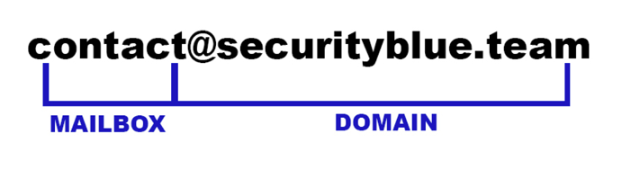
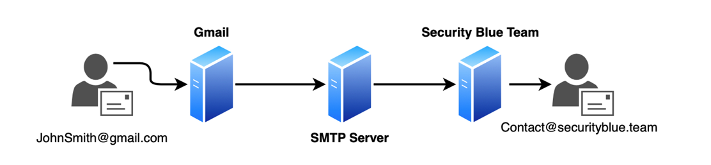
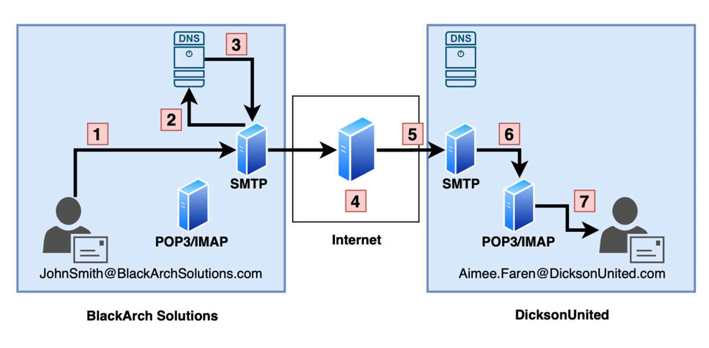
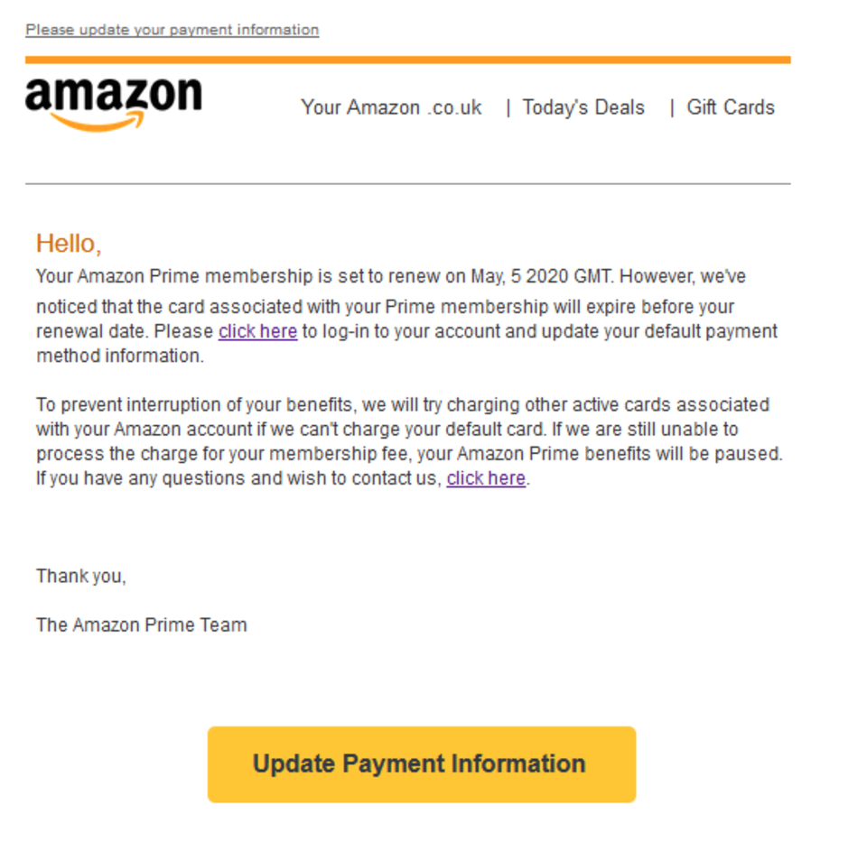
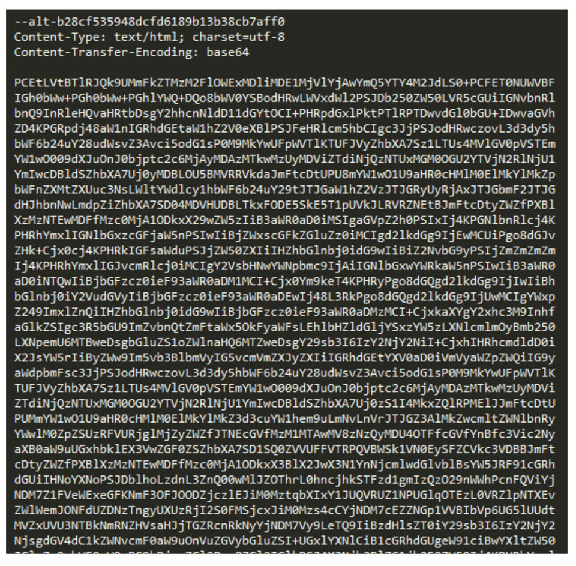
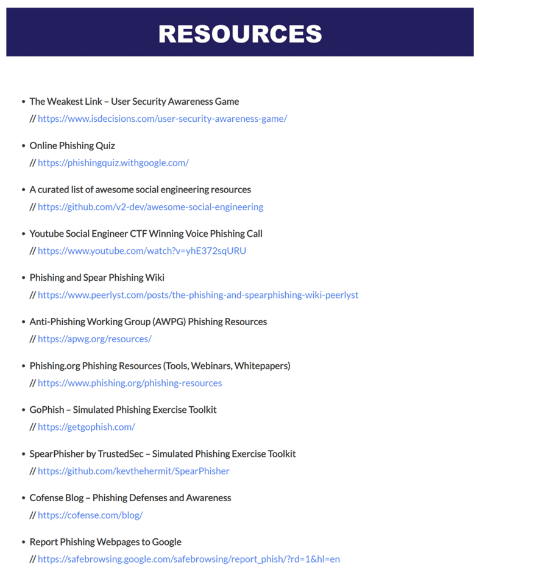

## Section Introduction
This course section covers email infrastructure, protocols, and structure, along with an introduction to phishing. Understanding how emails work helps in defending against phishing attacks, collecting artifacts for investigations, and implementing defensive measures. Phishing is the leading method of compromise, surpassing vulnerability exploitation, making its identification and mitigation essential for cybersecurity.

### 🎯 Learning Objectives
By the end of this section, you will be able to:

- Explain email structure, composition, transportation, and viewing in terms of infrastructure, protocols, and clients.
- Define phishing and its impact on confidentiality, integrity, availability, finances, and reputation for individuals and organizations.
- Understand phishing threats and their consequences for businesses and individuals.

****

## 🔗 How electronic mail works
 
Before we learn about phishing, it is essential to understand how emails work, both in terms of protocols and infrastructure. We will go over protocols as SMTP and POP3, email servers, relays, and email-client. Once we good understanding of how emails work, we will cover how emails are composed and how we can retrieve useful information from them with the ultimate goal of protecting an organization from future phishing attacks.

### 📌 Email addresses

Most people send emails on a daily basis - but what actually is an email address, and how does it help us to send and receive emails? Email address are composed of two parts, a mailbox and a domain. Let's take a look at an example:

In the above example we can see that the mailbox is named "contact" and the domain is "securityblue.team". We use a number of other mailboxes here at SBT including:
- certified@securityblue.team
- business@securityblue.team
- joshua@securityblue.team

So in its simplest form, email addresses help us to select the recipient of our message to ensure it reaches the right person or people. In the below example the sender is JohnSmith (mailbox) @gmail.com (domain), and the recipient is contact (mailbox) @securityblue.team (domain):

Don't worry about the servers or how emails are actually transported, we'll cover that in the below sections.

### 📌 Email protocols

#### Simple Mail Transfer Protocol (SMTP)

SMTP, operating by default on TCP port 25, is used for sending emails. Emails are transmitted through SMTP servers before reaching the recipient's organization. However, port 587 with TLS encryption is becoming the new standard for secure email submission, as recommended by the IETF.

#### Post Office Protocol 3 (POP3)
POP3 is an email retrieval protocol that downloads emails from a mail server to a local device and then deletes them from the server. This means emails can only be accessed from the device where they were downloaded, making it less flexible for multi-device access.

####  Internet Mail Access Protocol (IMAP)
IMAP allows email access from multiple devices by keeping emails stored on the server. Emails are only downloaded when manually saved, ensuring better accessibility across different devices like laptops, desktops, and mobile phones. This makes IMAP a more common choice than POP3.

In this below diagram, we will be following a scenario where Josh Smith working ar BlackArch Solutions is emailing a friend, Aimee Faren at DicksnUnited

1. John Smith writes an email, which is sent to his organization's outbound SMTP server.

2. The SMTP server queries the DNS server to find the IP address of "DicksonUnited.com".

3. The DNS server responds with the IP address, allowing the SMTP server to route the email correctly.

4. The email travels across the internet, possibly passing through multiple SMTP servers.

5. The email reaches the recipient's SMTP server.

6. The email is transferred to a POP3 or IMAP server, enabling the recipient to access it through their email client.

### 📌 Web email
Emails can be accessed via email clients like Outlook or Thunderbird, but webmail (e.g., Gmail, Outlook.com, Yahoo Mail) offers more convenience. Webmail allows users to check emails from any device with an internet connection and a browser, unlike email clients, which store emails locally and can work offline. The main advantage of webmail is accessibility from anywhere, while the disadvantage is the need for an active internet connection.

****
## 🔗 Anatony of an Email

### 📌 Email header

An email header contains transportation details like the sender's and recipient's addresses and timestamps from intermediary servers. It starts with the "From" line and updates at each server, allowing tracking of the email's path and processing time.

#### Header fields
The message itself, made up of the two following elements: the header fields, a set of lines describing the message's settings, such as the sender, the recipient, the date, etc. An email includes at least the three following headers:

- **From**, showing the sender's email address
- **To**, showing the recipient's email address
- **Date**, showing the date when the email was sent.

#### Optional header fields
It may also contain the following optional fields:

- **Received**, showing various information about the intermediary servers and the date when the message was processed 
- **Reply-To**, showing a reply address
- **subject** showing the message's subject
- **message-ID**, showing a unique identification for the message
- **message body**, containing the message, separated from the header by a line break

#### Custom X-Headers
Header data is not always reliable, as values can be manipulated, enabling sender spoofing. Custom X-headers (starting with "X-") can be used for additional information. For example, anti-spam software may mark spam emails with `X-Spam-Status: YES`.

### 📌 Email body

The email body contains the sender's message, which can be plain text or include hyperlinks, images, and HTML styling.

The example provided is a fake Amazon email that mimics the brand using Amazon’s colors and branding without spelling errors, making it appear legitimate.

Emails often use encoding, especially when incorporating HTML styling, to reduce their size. In this case, the email content is encoded in base64, as indicated in the third line of the screenshot. The next step is to decode it.

****

## 🧠 Phishing
Phishing is the act of sending emails with malicious intent to trick recipients into disclosing information, downloading malware, or taking unintended actions through social engineering techniques.

It is an email-based attack that targets humans rather than computer systems, manipulating them into actions like revealing credentials, installing malware, transferring money, or sharing sensitive information.

Variants of phishing include Vishing (voice call phishing) and SMiShing (SMS phishing), which use phone calls and text messages, respectively, to deceive victims.

## 🎣 Phishing impact

Phishing remains a **critical cybersecurity threat**, yet some organizations still overlook its importance. In 2019, **90% of data breaches** were linked to phishing (Retruster, 2019), with an **average financial impact of $3.86 million** per breach (IBM, 2019). Phishing is **cheap, effective, and requires only one successful attempt** to compromise a company's systems.

The threat is growing rapidly: **phishing attempts increased by 65% from 2018 to 2019** (Retruster, 2019), and 1.5 million new phishing sites are created monthly (Webroot, 2019). Attackers use advanced malware, such as Emotet, with up to 1 million phishing emails sent daily (Proofpoint, 2019).

This course equips you with the skills to **detect, analyze, and respond** to phishing threats, helping to protect organizations from this **highly effective attack vector**.

## 📚 Further Reading

This lesson provides additional reading materials on phishing analysis for students who need further clarification or want to deepen their understanding in preparation for the BTL1 practical exam. It is recommended to revisit this lesson after completing the domain.

For suggested resources, students can email BTL1@securityblue.team with the subject line "Phishing Analysis Domain Further Reading."

## 📚 Glossary

- I**OC (Indicator of Compromise)** – Intelligence from malicious activities (e.g., malware file hashes) used for threat detection and mitigation
- **Artifact** – Critical information extracted from emails, websites, or files (e.g., email addresses, IPs, file hashes).
- **File Hash** – A unique identifier generated by hashing algorithms (e.g., MD5, SHA1, SHA256). SHA256 is the industry standard.
- **Recon (Reconnaissance Phishing Email)** – Emails sent to check if a mailbox is active, often used for future phishing attacks.
- **Cred Harvester (Credential Harvester Phishing Email)** – Emails tricking users into entering credentials on fake login pages.
- **Vishing (Voice Phishing)** – Phishing attacks via voice calls using social engineering.
- **Smishing (SMS Phishing)** – Phishing attacks via SMS messages.
- B**EC (Business Email Compromise)** – Hacked organizational emails used for phishing or internal attacks.
- **SPF (Sender Policy Framework)** – A DNS record preventing email spoofing by verifying sender domains.
- **DMARC (Domain-based Message Authentication, Reporting & Conformance)** – An email authentication protocol enforcing SPF and DKIM policies.
- **DKIM (DomainKeys Identified Mail)** – A cryptographic method verifying email authenticity and preventing tampering.

