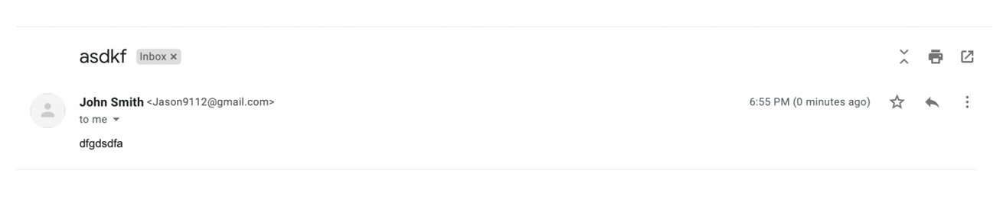
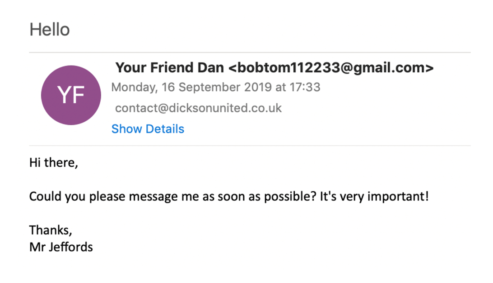

This section covers different types of phishing emails and how attackers use various methods to trick users into downloading malicious files or entering credentials on fake websites. Some techniques are more effective than others. Additionally, it explores social engineering tactics and false positives in phishing detection.

## 🎯 Learning Objectives
By the end of this section, you will be able to:

- Recognize different phishing attack types targeting individuals and organizations.

- Understand non-email-based phishing attacks, such as vishing (voice phishing) and smishing (SMS phishing).

- Identify and classify suspicious emails based on their design, context, and intent.

****

## 🕵️ Reconnaissance 

Reconnaissance emails (or recon emails) are designed to confirm whether a recipient’s email address is active. Attackers use them to prepare for future phishing attacks. A response isn’t always required—malicious actors can determine if an email was delivered or opened through various techniques.

### Types of Recon Emails:
- Spam with random text – Emails containing only meaningless text, such as "adjdfkaweasda."

- Social engineering emails – Messages designed to trick recipients into responding.

- Emails with tracking pixels – These use invisible trackers to detect when an email is opened.

By the end of this lesson, you’ll learn to recognize recon emails and identify any advanced tactics used.

### Tactics Used in Recon Emails:

1. **Spam Recon Emails**

Some reconnaissance emails contain no content or tactics; they are simply sent to check if the recipient's email address is valid. If an email bounces back with an error message like "undeliverable", attackers know the mailbox is inactive. If no error is received, they confirm the mailbox is active and may target it in future phishing attacks.

An example of this is when an email is sent to a nonexistent Gmail address, triggering an "undeliverable" response in Outlook or other email clients.


2. **Social Engineering Recon Emails**

Some reconnaissance emails use social engineering tactics to manipulate recipients into responding. These may involve:

- **Impersonation**: Attackers pose as someone familiar to the recipient, such as a colleague or superior.

- **Urgency**: Messages like “I’m about to meet with stakeholders—have you read the meeting notes?” create panic, leading to hasty actions.

- **Authority Exploitation**: Attackers pretend to be high-ranking officials (e.g., managers, directors) to pressure the target into compliance.

These tactics increase the likelihood of engagement, making impersonation emails a key method in **Business Email Compromise (BEC)** attacks, which will be covered in later lessons.

### Tracking Pixels recon emails

Tracking pixel recon emails combine elements of spam or social engineering emails with an invisible tracking pixel. This pixel allows attackers to determine if an email has been viewed and assess the mailbox's activity level. By monitoring the time between sending and opening, attackers can avoid inactive mailboxes to reduce detection risks.

A tracking pixel is embedded using HTML code in the email body, linking to an external pixel server. When the email is opened, the code loads, notifying the server.

**Data Collected via Tracking Pixels:**

- Operating System: Identifies if the target is using mobile or desktop.
- Email Client Type: Detects if the email is opened in a browser (webmail) or email client (Outlook, Thunderbird, etc.).
- Screen Resolution: Helps tailor phishing content for different devices.
- Date & Time Opened: Tracks user activity patterns.
- IP Address: Reveals ISP details and approximate location.

**Example of Tracking Pixel HTML Code**
```html

```
This code loads a tiny image hosted on an external server, allowing attackers to log email interactions.

**Defense Against Tracking Pixel Attacks**
- Disable automatic image loading in email clients.
- Use email security gateways that strip tracking pixels.
- Monitor network requests for suspicious external image loads.

### Recon email example 1
In this example, an email from Jason9112@gmail.com appears under the name John Smith and contains a random subject line ("asdkf") with meaningless body content. This is a spam recon email, designed to check if the recipient's mailbox is active.

The attacker is not expecting a human response since the email lacks a request or action. Instead, they are monitoring whether an "undeliverable" message is generated. If no such message is received, the attacker confirms the mailbox is valid and may target it in future phishing attempts.



### Recon email example 2
In this case, bobtom112233@gmail.com sends an email to contact@dicksonunited.co.uk with the subject "Hello" and a vague message starting with "hi there". The email lacks personalization and does not seem directed at a specific individual.

A key red flag is that the sender claims to be "your friend Dan", yet the email is sent to a group mailbox ("contact@domain"), which is unusual for personal communication. This suggests the email is a recon email, designed to check if the recipient's mailbox is active for future phishing attempts.



### Conclusion
Recon emails are frequently encountered by large organizations and often bypass email security gateways since they lack obvious malicious indicators. Basic recon emails contain only body text, while more advanced versions may use social engineering or tracking pixels to gather additional intelligence.

Once attackers confirm that an email address is active, it can either be sold to other malicious actors for phishing campaigns or used directly by the original sender for future targeted attacks.


****
## 📧 Spam Emails

Spam emails (also known as "junk mail") are messages that are unsolicited, unwanted, or unexpected but are not necessarily malicious in nature. Examples of spam emails are:

- Newsletters that the user has unknowingly signed up for
- Marketing emails trying to promote products and services
- Update announcements from companies and services the user has registered with

Spam emails should not be confused with malicious spam emails (malspam for short). Malicious spam emails are malicious messages that are sent on a mass scale (as opposed to being targeted at an individual or organization).


Above is a screenshot from a honeypot mailbox we use to collect spam and malicious emails. You can see the scale of the unsolicited spam emails we have received, with the majority being bitcoin-based, trying to get recipients to sign up to different cryptocurrency exchanges or buy into schemes to make them millions! Without further investigation, these emails would be classified as spam, but some could potentially be malspam.

Our junk inbox included emails covering the following topics:

- Bitcoin/cryptocurrency
- Personal Protective Equipment (PPE - expected to see emails of this nature due to COVID-19 pandemic at time of writing)
- Sexual performance-enhancing products
- Non-cryptocurrency financial schemes
- Adult dating
- Marketing emails from restaurants
- Diet/weight-altering products

It's worth mentioning that we haven't signed up to receive these emails. It appears that this email address has been shared or sold between organizations, and we have been added to email marketing lists without our expressed permission.

### Examples of Spam Emails 1
A WordPress plugin vendor sends marketing emails to registered users who likely consented by agreeing to the Terms of Service and Privacy Policy during registration. Although these emails are not malicious, they are often unwanted and contribute to mailbox clutter. Such emails should include an "unsubscribe" link at the bottom, allowing recipients to remove themselves from the mailing list.


### Examples of Spam Emails 2


### Conclusion
While spam emails are usually not malicious, users should be cautious, avoiding attachments and hyperlinks. Organizations may instruct users to delete such emails or report them to security teams. Spam should not be confused with malicious spam (malspam), which spreads malware like Emotet. Spam can also serve reconnaissance purposes, where clicking an unsubscribe link may enable system fingerprinting and confirm mailbox activity.

****
